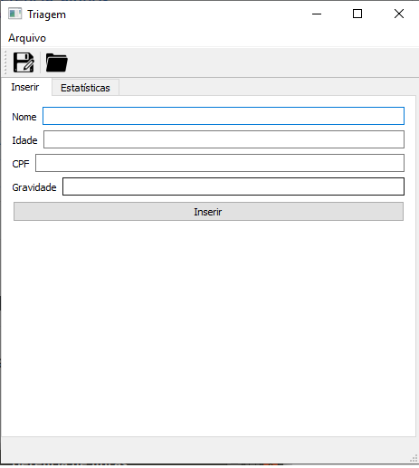
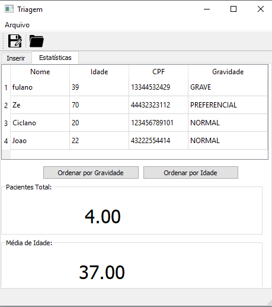
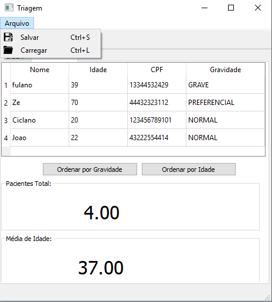

# Triagem de prioridade de atendimento

## O que é triagem?

O Bloco Emergencial do Hospital/UPA recebe, todos os dias, pacientes com as mais diversas necessidades, desde aqueles que correm risco iminente de morte até aqueles que, embora demandem cuidados médicos, não se encontram em estado de urgência. 

Para haver a garantia de atendimento prioritário aos casos mais graves, todos os pacientes que chegam ao Pronto-Socorro passam por uma triagem, ou seja, uma avaliação inicial feita por um profissional de saúde. Após a triagem, os pacientes são identificados por grau de necessidade, de acordo com a prioridade de atendimento, sejam eles: "Normal"; "Preferencial"; "Grave". 

São inegáveis os benefícios que esse tipo de método oferece, não só para o hospital/UPA, mas também para os pacientes. Isso pode fazer total diferença na hora de salvar uma vida. Afinal de contas, alguns minutos podem ser cruciais. Por outro lado, ajuda a reduzir a ansiedade e a expectativa do paciente quanto ao atendimento. Haja vista que, a partir do tempo máximo de espera, ele se sente mais tranquilo. 

Além disso, sabendo exatamente qual é a necessidade e urgência de cada paciente ali na fila de espera, é possível direcioná-las para outros serviços de saúde caso a demanda naquele momento seja maior do que o hospital/UPA pode suportar.

## Ferramenta Desenvolvida

Com o intuito de resolver a problemática apresentada, e de modo a contribuir na agilidade e comodidade do atendimento, foi desenvolvido um software – baseado na ferramenta de desenvolvimento de interfaces gráficas em C++, o "qtCreator" – que fosse capaz de armazenar dados dos pacientes de modo a agilizar o atendimento daqueles mais necessitados ao organizar a lista de espera segundo a gravidade desses.

## Funcionalidades

O programa apresentado, conta com duas abas. Na primeira aba, conforme apresentado na imagem abaixo, está a página para entrada de dados do paciente, na qual é possível armazenar o nome, idade e cpf dele, bem como a gravidade dada pelo profissional de saúde que estará fazendo a triagem. Os dados serão salvos e apresentados na tabela, que está situada na segunda aba, após pressionar o botão "Inserir".

Na mesma tela, é possível ver dois ícones. O primeiro, visto da esquerda para direita, tem a função de salvar a tabela em um arquivo (.txt), já o segundo ícone faz o carregamento de arquivo já salvo.

A segunda aba do programa conta com uma análise estatística dos dados, mostrando a tabela preenchida através dos dados passados da primeira aba ou de algum arquivo carregado. Essa tabela pode ser organizada pela gravidade dos pacientes como também pela idade dos mesmos. Além disso, mostra-se a quantidade de pacientes e a média de idade.

As duas abas apresentam funcionalidades em comum. Uma delas já foi mencionada, os ícones. Também é possível salvar os dados da tabela, ou carregar valores para a tabela, acessando o menu no canto superior esquerdo.

